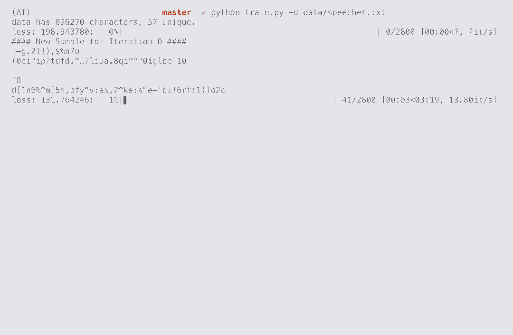

# Generate Any Text
Generate any kind of text with character embedding and RNN in pure Numpy.

Note that this project is not optimized for performance. It is rather a reference implementation for many building blocks of neural networks. 

**[Check this list](Example Training) to reach implemented elements.**

## Example Training
Clone the repository and change directory into it
```
git clone https://github.com/kirbiyik/generate-any-text
cd generate-any-text
```

This project has only 3 dependencies: Numpy for numeric computation, tqdm for progress bar and matplotlib for plotting. You probably already have these. Otherwise run command below. 
```
pip install -r requirements.txt
```

Download the Trump speeches dataset 
```
wget -P data/ https://github.com/ryanmcdermott/trump-speeches/blob/master/speeches.txt
```

Start training
```
python train.py -d data/speeches.txt 
```
[See the other arguments.](https://github.com/kirbiyik/generate-any-text/blob/master/train.py#L11)


Here is an example footage of training. It learns how to generate Trump-like tweets with a 3 minutes training in CPU.




## Example Inference
Models will be saved under `model-files` unless explicitly specified.
```
python inference.py -m model-files/char_rnn_epoch3.pkl -s i
```
[See the other arguments.](https://github.com/kirbiyik/generate-any-text/blob/master/inference.py#L9)

## Elements 
Click on any item to go related line of code.

- [CharRNN (Sequence to Sequence RNN to produce characters with temperature)](https://github.com/kirbiyik/generate-any-text/blob/master/src/model/CharRNN.py)
- [Unit tests with numerical gradients to check implementations ](https://github.com/kirbiyik/generate-any-text/blob/master/tests/layers.py)
- [Character Embedding](https://github.com/kirbiyik/generate-any-text/blob/master/src/layers/char_embedding.py)
- [Recurrent Neural Networks](https://github.com/kirbiyik/generate-any-text/blob/master/src/layers/rnn.py)
- [Temporal Affine Layer](https://github.com/kirbiyik/generate-any-text/blob/master/src/layers/fully_connected.py)
- [Temporal Softmax](https://github.com/kirbiyik/generate-any-text/blob/master/src/layers/temporal_softmax.py)
- [Adam optimizer](https://github.com/kirbiyik/generate-any-text/blob/master/src/optimizer/adam.py)
- [Solver (Run training loop, update weights, save model, record logs, etc.)](https://github.com/kirbiyik/generate-any-text/blob/master/src/solver/CharRNNSolver.py)
- [Data loading, character mapping, masking non-frequent characters](https://github.com/kirbiyik/generate-any-text/blob/master/src/dataloader/batches_from_txt.py)

## Testing
Run unit tests with

```
python tests/layers.py
```

## Dataset
[Trump speeches dataset is used for demonstration.](https://github.com/ryanmcdermott/trump-speeches/blob/master/speeches.txt) Though it is possible to use any kind of text file. It does not require any special format. It learns what you feed!

[Here is a resource for many free eBooks.](http://www.gutenberg.org/)

## Acknowledgement
This work is heavily based on [Stanford's CS 231n Assignments](http://cs231n.github.io/). I've implemented additional layers and features for the special needs of this problem.

